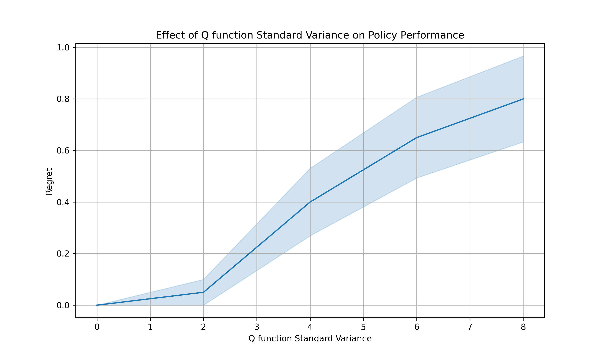

<!-- # ClusterRL -->

<!-- ### File Overview

- Folder `functions/`: 
    - `generate_team_competition_data` generate team competition data.
    - `team_matching_training_new` implements three algorithms with homogeneous Q function (one-step policy iteration, Offline FQI (Next-State Maximum), Offline FQI (All Encountered States)) and their online versions.
    - `team_matching_execution` solve the linear optimzation with a q function

- Folder `cluster_level_policy`:
    - `sim_matching_new` conduct simulation in different settings (tab1, tab2, ctn1, ctn2, ctn3).
    - `run_sim_matching_new` run simulations on a local computer.
    - `create_matching_new.sh` run simulations on clusters. -->

# xx
This repository contains the implementation for the paper "xx" in Python. 
This paper focuses on reinforcement learning (RL) in clustered environments with limited data, a common scenario in healthcare applications. We propose an optimal policy learning algorithm that integrates Generalized Estimating Equations (GEE) into the Bellman equation framework to account for intra-cluster correlations. Our approach not only minimizes the variance of the Q-function estimator but also ensures that the derived policy achieves minimal regret. 

We illustrate the motivation behind the proposed approach through a simple tabular example where the optimal Q-function is analytically known (See Section 3.1 for details). Increasing the variance of the Q-function leads to higher regret in the derived policies.

## File Overview

- Folder `functions/`:
    - `generate_joint_data`: Generates data for simulation.
    - `GEE_Q`: Implements the generatlized Fitted Q iteration (FQI) and the optimal FQI with GEE.
    - `cov_struct`: Contains several correlation structures for GEE.
    - `utilities`: Contains some helping functions.

- Folder `simulation/`:
    - `R_autoex`: Runs the generalized FQI and the proposed optimal FQI with different within cluster correlation structures. 
    - `create_r_autoex.sh`: Creates SLURM jobs to run `R_autoex.py`.
    - `Qonline_single.py`: Run online DQN to approximate the optimal Q function.
    - `create_online_Q.sh`: Creates SLURM jobs to run `Qonline_single.py`.

- Folder `simulation/regret`:
    - `value_comparison.py`: Estimates the regret of the optimal Q function with different noise variance.
    - `create_value_comparison.sh`: Creates SLURM jobs to run `value_comparison.py`.